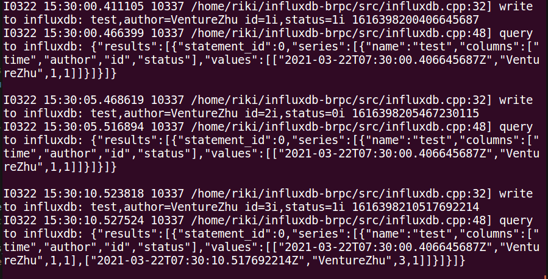

# influxdb C++ Client in BRPC
## Background 
Influxdb don't support official C++ client lib so that there are a lot of clients on github.    
Luckily, influx provide convinient Restful API, DIY client is easy.   
e.g. 
- [orca-zhang/influxdb-cpp](https://github.com/orca-zhang/influxdb-cpp)
- [awegrzyn/influxdb-cxx](https://github.com/awegrzyn/influxdb-cxx)

However, these lib implements http naively, without connection pool and async call, and so on.
- Without connection pool, frequent requests will produce considerable overheads.
- Without async call, the latency to cloud is a disaster.

So I choose BRPC ecology to improve network performance. BRPC implement these mechanisms in a powerful channel which supports HTTP.  
Formatting Utils from the projects listed.

## Environment
from [BRPC official document](https://github.com/apache/incubator-brpc/blob/master/docs/cn/getting_started.md)  
To prepare dependencies
```sh
sudo apt-get install -y git g++ make libssl-dev libgflags-dev libprotobuf-dev libprotoc-dev protobuf-compiler libleveldb-dev
```
To install
```sh
git clone https://github.com/apache/incubator-brpc.git
cd incubator-brpc
mkdir build
cmake ..
make
make install
```

## Quick Start
Your influxDB should be alive. And then run the demo client.
```sh
mkdir build
cmake ..
make
./storage_client
```
Log:


## Feature
- Use brpc to enhance http performance.
- Basic API support: single insert / query

## TODO            
- unit test  
- async call
- JSON result parser
- more API
- batch write
